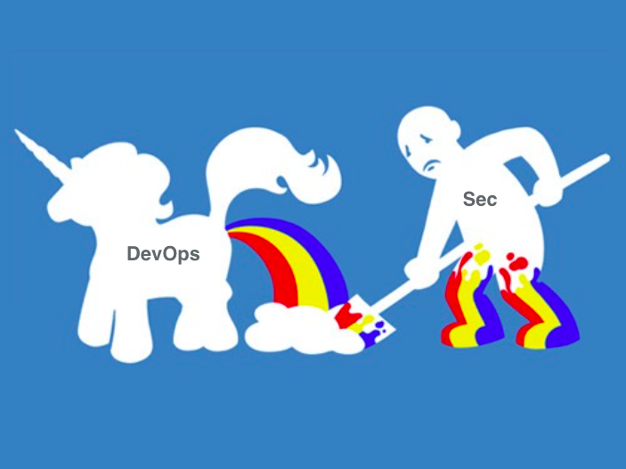

#  Concourse CI
### https://concourse.ci/

---

# Another CI Platform?

---

---

# CI == Continuous Integration

---

# Continuous Integration
- Run unit/integration tests on checkin/push
- Run on a platform closer to production
- Continuously integrate with master regularly

---

# CI - Gen 1
- Started in 2001 with release of CruiseControl
- First implementation of CI
- Jobs configured with XML on the server
- Centralized server
- Polling model

^ Inspired by 1994 Grady Booch's Object-Oriented Analysis and Design with
Applications and later in 1997 with Kent Beck and Ron Jeffries Extreme Program

---

# CI - Gen 2
- Started in 2005 with release of Hudson (now Jenkins)
- Slick GUI based configuration
- Plugins and GUI based configuration
- TeamCity released in 2006, Bamboo released in 2007

  

^ These are probably the most popular Gen 2 CI servers.
- Gen 1 centralization carried foward
- Snowflake servers

---

# CI - Gen 3
- Started in 2011 with release of Travis
- :cloud: based
- Configuration done through file in repository
- Running builds in containers
- Real focus on deployment

  

---

# CI - Gen 3+
- Started in 2007 or later with GoCD
- Concept of pipelines, real separation of build/deployment
- Came out of Continuous Delivery book
- ConcourseCI released in 2014
- Inspired pipelines in Jenkins 2.x, GitLab, etc

 

---

# Why Not Bamboo?
- Gen 2 CI/CD
- CD bolted on
- APIs... what APIs?
- Everything in GUI
- :snowflake: everywhere
- Scaling hard

---

# Why Concourse?
- All configuration is source controlled
  - no GUI config even possible!
- Isolated builds
  - Docker, all the down :turtle:
- Open Source

^ Configuration being source controlled makes the configuration highly
portable. The need to nurture a a unique snowflake build server (like
bamboo) are removed.

^ Docker, sort of... we'll get into the architecture soon.

---

# So we dug deeper...
- Very scalable
  - Just add stateless `workers` which host containers
  - Lots of parallelism
- Debuggable builds
  - `hijack` recent builds
- Add your own resources (any language)
  - As long as they support basic API

^ Resources are executables that need to support a basic contract
and can thus be in any language- could even be a shell script.

---

# Three core concepts
1. Tasks
2. Resources
3. Jobs

---

# Tasks

> A task is the execution of a script in an isolated environment with dependent resources available to it.
-- concourse.ci

---

# Tasks
- Run off of :whale: images
- Exit 0 :white_check_mark:
- Exit !0 :x:

---

# :no_entry: :whale: :no_entry:

---

# :no_entry: :whale: :no_entry:
- Tasks run inside Garden Container :seedling: :herb: :blossom:
 - Same primitive as Cloud Foundry
 - :penguin: :house_with_garden:
- Compatible with Docker images, can even build them.

---

# Resources

> A resource is any entity that can be checked for new versions, pulled down at a specific version, and/or pushed up to idempotently create new versions.
-- concourse.ci

---

# Resources - Get
- Git resources
- Time <- scheduler
- S3 bucket
- Etc.

---

# Resources - Put
- Email
- Slack/HipChat notification
- GitHub Release
- CF Deployment

---

# Jobs

> At a high level, a job describes some actions to perform when dependent resources change (or when manually triggered).
-- concourse.ci

---

# Jobs
- Combines resources and tasks.
- Builds are an instance of a job.

---

# Demo

---

^ Looks like fantastic DevOps magic

---

^ But of course nothing is rainbows and butterfly

---

# Pros
- Configurations in source control!
- Isolated builds
- First class pipelines
- Easy to scale
- Build local code on CI
- Easy debugging of builds
- Theoritically easy deploy on PCF
- Open Source

---

# Cons
- BOSH is primary deployment platform
 - Although binary install available
- No ACL support yet
- Small community, not a lot of plugins yet
- No commercial support yet

^ Community might stay small with the strong focus on BOSH. Tile is probably
coming soon.
